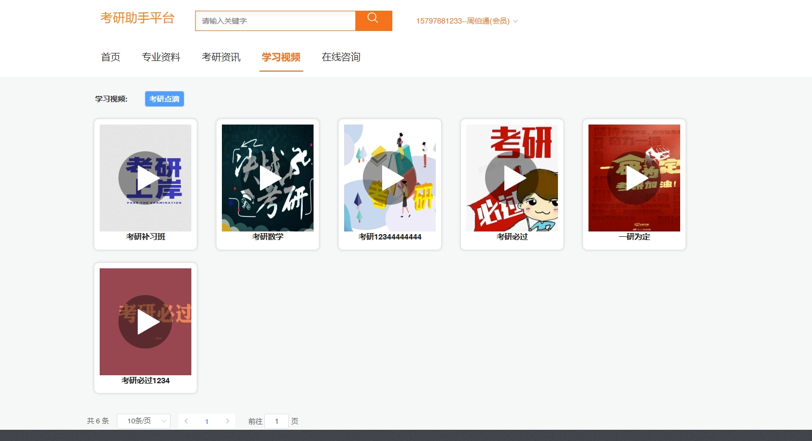
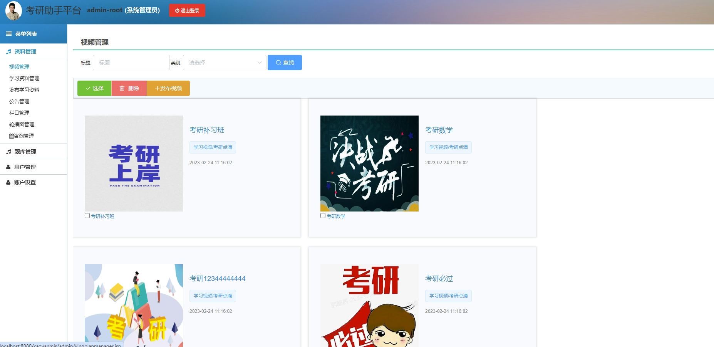
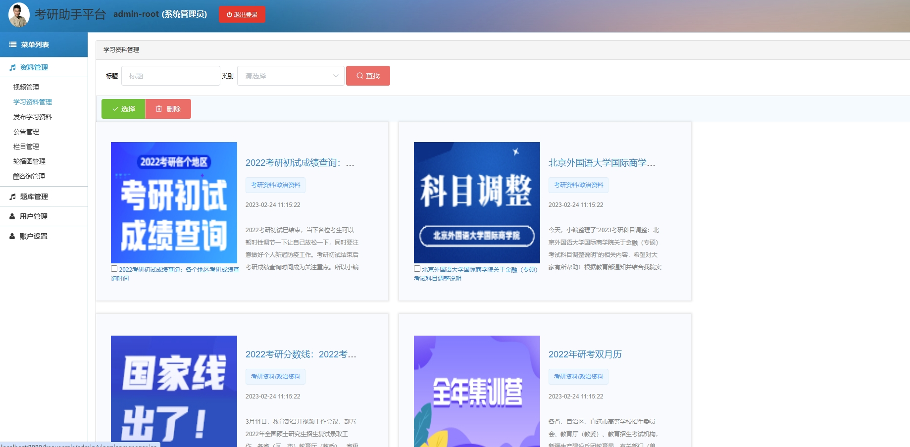
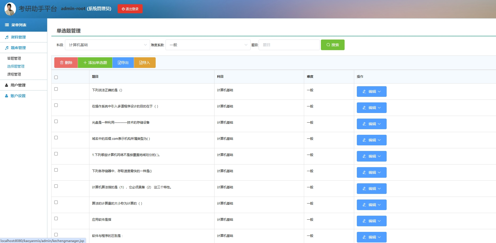
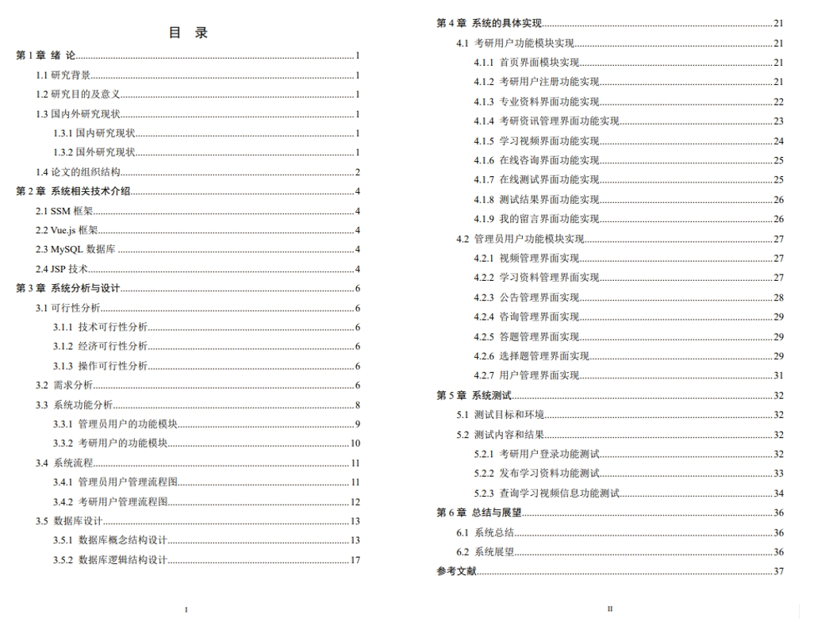
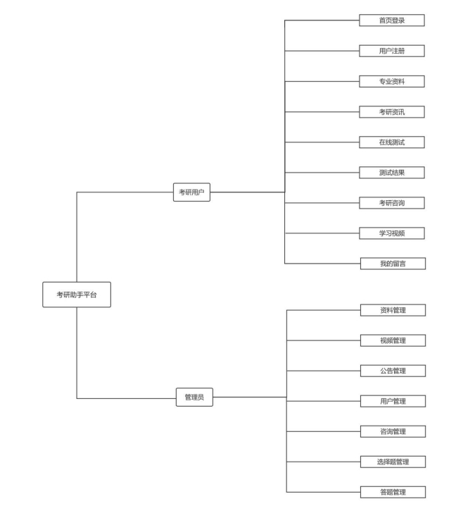

# 基于SpringBoot的考研助手系统
**项目经过本人本地测试，确保可以运行，项目仅用于学习或毕业设计参考~**
# 1.项目简介
- 测试环境：idea2022，MySQL5.7

- 技术栈：SpringBoot， JSP，Vue.js，MyBatis

- 角色：管理员，会员

# 2.项目部署
-  导入数据库(使用navicat或者其他工具，我的数据库编码是utf8mb4，排序默认）

-  按照你的数据库环境，修改代码

- 启动项目，门户地址：http://localhost:8080/kaoyanmis  账号密码：15797881233/123456

- 后端管理web：http://localhost:8080/kaoyanmis/admin/login.jsp 账号密码：admin/admin  或者查看数据表

# 3.项目部分截图

# 4.获取方式
获取方式：[戳我查看](https://gitee.com/aven999/mall)💕
